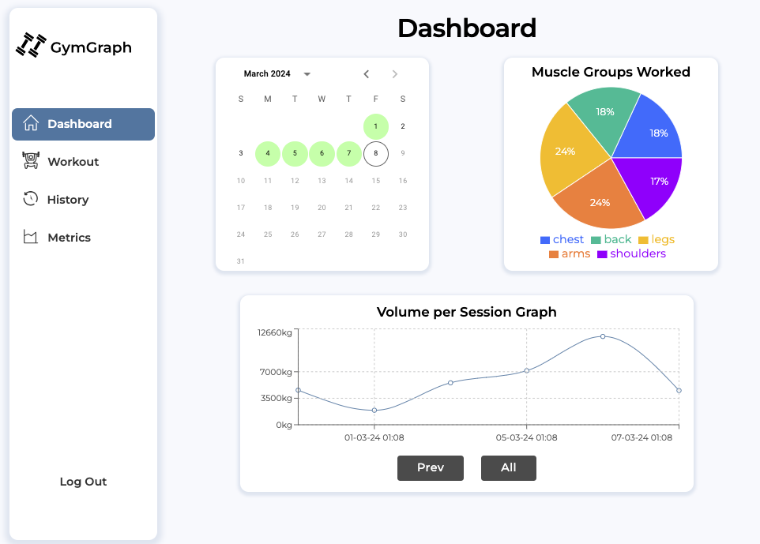
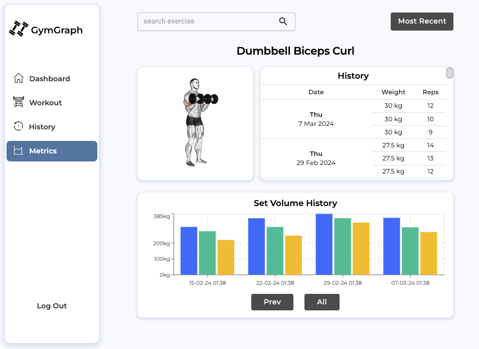
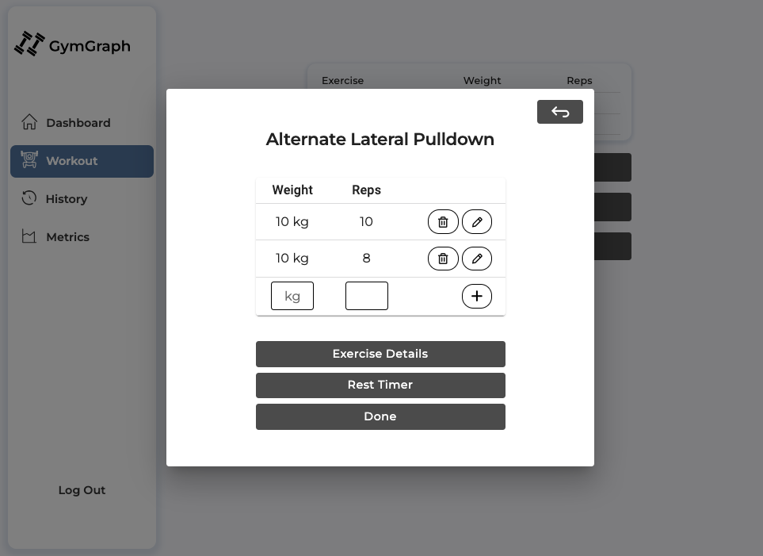
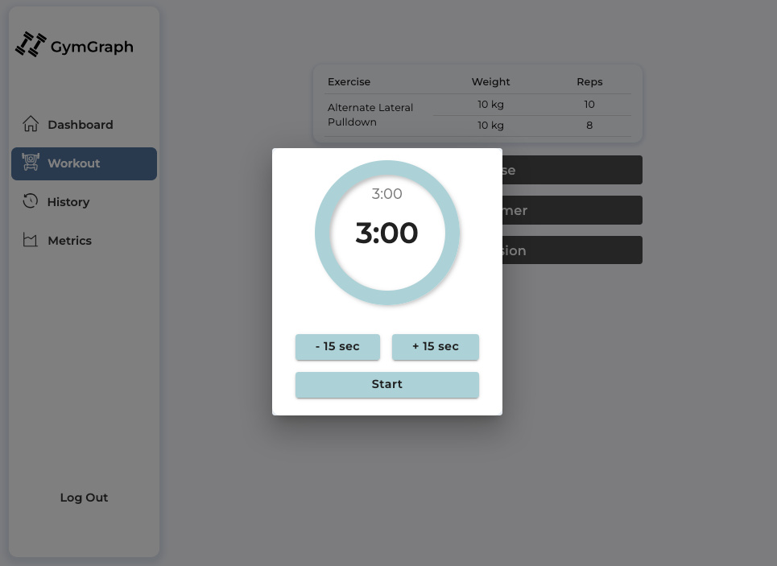

# GymGraph

A full stack weight lifting tracker app.

## :open_book: Table of Contents
- [Screenshots](#camera_flash-screenshots)
- [Features](#sparkles-features)
- [Technologies Used](#rocket-technologies-used)
- [Project Purpose](#bulb-project-purpose)
- [Lessons Learnt](#books-lessons-learnt)
- [Future Features](#seedling-future-features)

## :camera_flash: Screenshots

## :sparkles: Features

-   **User Authentication**: Offers a streamlined account creation process, allowing users to sign up using their email and a secure password. Alternatively, for enhanced convenience, users have the option to sign in directly using their Google account.
-   **Exercise Database**: A comprehensive database of over 1,200 exercises with descriptions, muscle groups targeted, and detailed animations demonstrating proper form.
-   **Progress Tracking**: Features for tracking workouts, including sets, reps, and weights lifted. 
-   **Analytics**: Graphs and charts to visualize progress over time.
-   **Countdown Timer**: A timer you can use to ensure you rest for long enough between sets for optimal hypertrophy.
-   **Calendar**: A calendar which highlights the days you have completed a gym session in green. When you click on the day in the calendar a modal opens and shows a summary of all exercises you have done for that day.  
-   **History using Pagination**: View your exercise history. This feature uses pagination to query the backend for only the data needed to fill the page. This avoid unnecessary payloads of data being requested, reducing load times and backend costs. 
-   **Mobile Responsiveness**: Designed to provide an excellent user experience on both mobile and desktop devices.

## :rocket: Technologies Used
-   **Frontend**:
    -   HTML/CSS/JavaScript
    -   React
    -   Vite 

- **Backend**
    - Firebase (Firestore/Authentication/Hosting)
    - Python (for scripting)

- **Testing**
    - Jest/Vitest
    - React Testing Library 
    - React Developer Tools (Chrome extension)

-   **Libraries**:
    - Material UI
    - React Router
    - Recharts

- **Other**
    - Jira (for project management)
    - Git and Github (for version control/repository hosting)
    - Figma (for initial design)

## :bulb: Project Purpose
I wanted to work on a larger scale, full stack project. I found the weight lifting tracking app I personally used didn't have the functionality and user experience I wanted, so I built one myself. 

A key focus I had for this project was to learn more about testing. I learnt a lot about good testing practices, when and what to test, and the different testing strategies including unit testing, integration testing and end-to-end (E2E) testing. I documented my lessons in the 'Lessons Learnt' section of this page.

Other key areas I wanted to focus on included project management (using Jira), folder management, and clean code practices (reusability/readability/maintainability etc).

I decided on using Firebase for the backend mainly for the simplicity and time saved by working with a Backend-as-a-Service (BaaS). I initially considered building the backend with Django/Python, however realised it would take a significantly longer time to build compared to Firebase, and my focus for this project was to improve my frontend and testing skills. 

## :books: Lessons Learnt
### Handling Authentication State on Reload
I implemented protected routes in my Router component and noticed that upon page reload, it seemed as though the user was signed out. Using console logging and React dev tools, I discovered that while the user details persisted in local storage, the user Auth context reset to null due to the app reloading. 

The page would initially mount with the user set to null and later update to the user data stored in local storage. This asynchronous update resulted in the Router rendering protected routes with a null user, effectively logging out the user. 

The solution was to introduce a loading state in the AuthProvider component. When the page reloads, this loading state is true, the useEffect hook updates the user state based on the Firebase data, then sets loading to false. Consequently, the context updates with the correct user info, resolving the issue.

### Network Request Error in Testing
While testing routing from the 'underConstruction' page, an ECONNREFUSED error occurred during React-test-library tests. The error didn't prevent the test from passing, but it indicated a network request issue. Investigation revealed that requests were made for SVGs, used via 'react-svg' to dynamically render and modify them. 

Initially, mocking the SVGs didn't solve the issue. Further research showed that the problem was with the imported library *ReactSVG* components themselves. Mocking these components resolved the error, and I shared this solution to a question on *StackOverflow* from someone who encountered the same issue, but for which no solutions were posted.

### Rehydrating State Stored in localStorage
For workout sessions, I decided to store exercise and set data in localStorage to prevent loss upon navigation (and thus rerendering). However, after a page reload, class methods like *updateSetFromExercise* (which updates a specified set for a given exercise) were undefined, causing errors.

I found the issue was that localStorage only stored data, not class methods. To fix this, I adapted the SessionExercises class to accept a parsed JSON object and rehydrate it into class objects with necessary methods. This resolved the issue, allowing the state to update from localStorage correctly.

### Refactoring for Code Maintainability/Readability
Initially, I hard-coded state updates for workout sessions, violating the DRY principle and complicating maintenance. 

By creating a *SessionExercises* class, I streamlined CRUD operations through clear, concise class methods. This approach simplified the code, enhanced readability, and made the implementation easily adjustable without affecting the overall application.

## :test_tube: Testing Lessons Learnt
### The Value of TDD
Through testing the *addGoogleUserToDb* function, I realized the drawbacks of heavy coupling with Firebase. The tests would break if the backend was changed. This highlighted the importance of writing functions independent of specific database services, underlining the principle of TDD to test interfaces, not implementations. TDD promotes writing more reusable, maintainable, and testable code.

### The Cons of TDD
TDD requires well-defined specifications, which can be a limitation. During development, I often found better UI/UX implementations than I had initially planned, necessitating refactoring and resulting in time lost. 

TDD also involves frequent context switching, which can hinder productivity. These experiences taught me to weigh the use of TDD against project requirements/specification, timeline, and the clarity of specifications.

### Write Tests for Reliability, Not 100% Coverage
I had initially aimed for 100% test coverage, however I realized the impracticality of extensively testing simple components (like for example  <i>StartWorkoutButton</i>). 

The focus shifted to ensuring app reliability and maintainability. Decisions on unit testing each component should factor in considerations such as **criticality, complexity, frequency of change, and reusability**. Additionally, employing a mix of testing strategies, including unit, E2E, and integration testing, is crucial for comprehensive app reliability, not solely relying on unit tests.

### The Nuances of Testing
The debate on the extent of unit testing taught me that testing requirements should align with the project's context. 

Factors like client preferences, project timeline, and application criticality dictate the testing approach. 

For instance, software for pacemakers may require 100% test coverage, while other projects might prioritize speed over perfection. Testing is essential, but its scope and intensity should be project-specific and **considered a requirements issue** as suggested in *The Pragmatic Programmer* by Andy Hunt and Dave Thomas.

## :seedling: Future Features
With an application like this the opportunities for additional features are endless. Some of the keys things I would want to add include: 
- **Social Integration**: Functionality for users to connect with friends, share workouts, achievements, and potentially find workout partners.
- **Community and Support**: Forums or chat groups for users to discuss workouts, share tips, and offer support.
- **Gamification Elements**: Features like badges, challenges, and leaderboards to motivate users by making the process of lifting weights more engaging and competitive.
- **Personalised AI Recommendations**: Using AI to suggest personalised workouts and suggestions based on user data and progress.